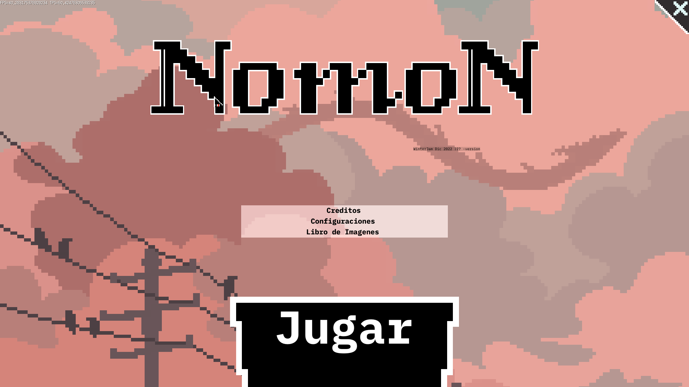

## Personal Projects

### Use Go and Ebitengine

this project is a WinterJam2022, I use golang and ebitengine. es mi primer intento de video juego y mi primera jam
(nota el projecto esta mal optimizado)
Contiene:
- impreso de fuentes
- gestion de idiomas
- configuraciones de usuario
- cambios de escenas y en memoria
- escalamiento y pocision de elementos en pantalla
- Nota: El proyecto no esta terminado fue un acercamiento para aprender

PDT: las fuentes y los fondo, creditos a quien corresponda

